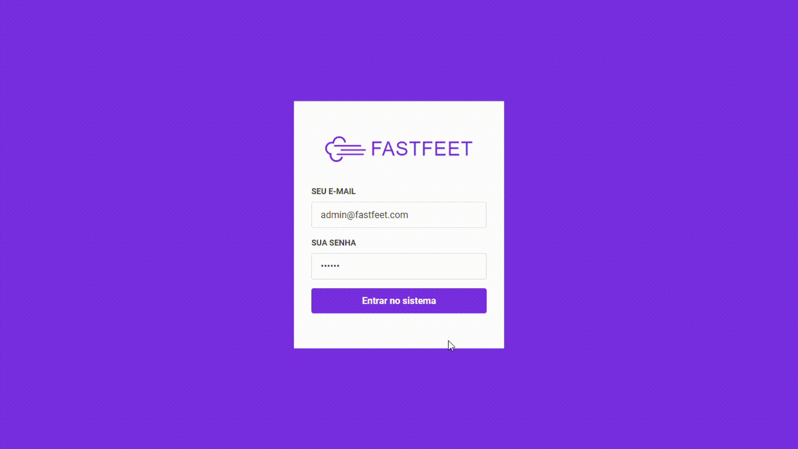

<h1 align="center">
  
</h1>

<h3 align="center">
  Aplicação web com ReactJS para o aplicativo FastFeet
</h3>

<p align="center">
  

  <a href="https://www.linkedin.com/in/guilhermehenrry/">
    
  </a>

  
</p>

<p align="center">
  
</p>

## Como utilizar

```bash
# Instalar dependencias
$ yarn

# Execute o projeto na porta 3000
$ yarn start
```

---

Feito com 💜 by [Gui Henrry](https://www.linkedin.com/in/guilhermehenrry/) ✌
